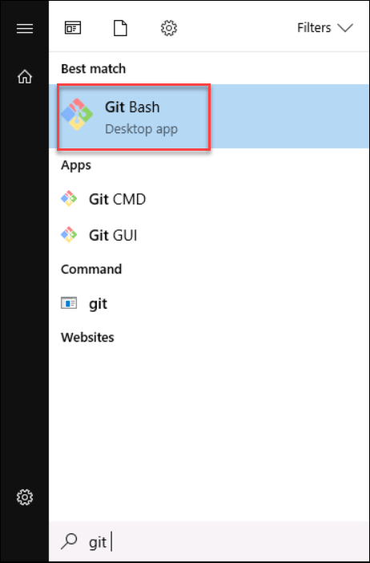
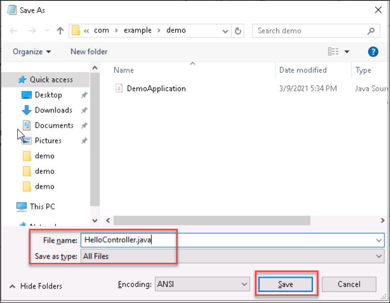
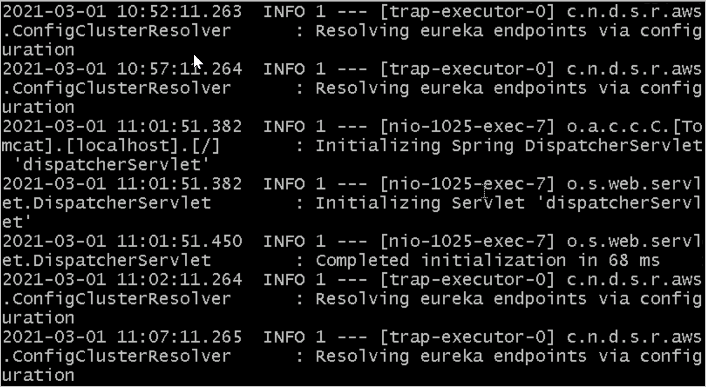

# Exercise 5 - Build a Spring Boot microservice using Spring Cloud features

In this exercise, we'll build a similar service to the one from exercise 2, but with the addition of two important Spring Cloud features. First, we'll add this service to Spring Cloud registry for discovery by other services. Second, we'll use Spring Cloud Config to inject a setting from a Git repository into the application and display it on the screen.

---

## What we are going to build

1. We are going to build again a simple Spring Boot microservice like in exercise 2, but this time it will use two major Spring Cloud features:

2. It will be connected to a Spring Cloud Service Registry so it can discover other microservices, as well as being discovered itself!

3. It will get its configuration from the Spring Cloud Config server that we configured in exercise 4.

4. For both features, it will just be a matter of adding an official Spring Boot starter, and Azure Spring Cloud will take care of everything else.

## Task 1 : Create a simple Spring Cloud microservice

1. Open Git bash from the start menu if not already open, and login by using the following command: 

```bash
az login # Sign into an azure account
az account show # See the currently signed-in account.
```



2. To create our microservice, we will invoke the Spring Initalizer service from the command line:

```bash
curl https://start.spring.io/starter.tgz -d dependencies=web,cloud-eureka,cloud-config-client -d baseDir=spring-cloud-microservice -d bootVersion=2.3.8 -d javaVersion=1.8 | tar -xzvf -
```

> This time, we add the `Eureka Discovery Client` and the `Config Client` Spring Boot starters, which will respectively automatically trigger the use of Spring Cloud Service Registry and the Spring Cloud Config Server.

## Task 2 : Add a new Spring MVC Controller

1. Navigate to the path `C:\Users\demouser\spring-cloud-microservice\src\main\java\com\example\demo`


2. Open with notepad, then remove and paste the content with the below code in a new file:

```java
package com.example.demo;

import org.springframework.beans.factory.annotation.Value;
import org.springframework.web.bind.annotation.GetMapping;
import org.springframework.web.bind.annotation.RestController;

@RestController
public class HelloController {

    @Value("${application.message:Not configured by a Spring Cloud Server}")
    private String message;

    @GetMapping("/hello")
    public String hello() {
        return message + '\n';
    }
}
```
3. Save the file next to `DemoApplication.java` in the `C:\Users\demouser\spring-cloud-microservice\src\main\java\com\example\demo` as `HelloController.java` by changing the **save as type** to all files and then **save** as shown below.



## Task 3 : Test the project locally

1. Before deploying the microservice to Azure Spring Cloud, let's run it locally.

>💡 Do not be alarmed when you see exception stack traces:
> 
>Spring Cloud is attempting to contact a local configuration server, which we have not provided. The application will still start using any available local settings and defaults.

2. To run `simple-cloud-microservice` locally:

```bash
cd spring-cloud-microservice
./mvnw spring-boot:run &
cd ..
```

3. Requesting the `/hello` endpoint should return the "Not configured by a Spring Cloud Server" message.

```bash
curl http://127.0.0.1:8080/hello
```


4. Kill the locally running microservice:

```bash
kill %1
```

## Task 4 : Create and deploy the application on Azure Spring Cloud

1. As in exercise 2, we create a specific `spring-cloud-microservice` application in your Azure Spring Cloud instance:

```bash
az spring-cloud app create -n spring-cloud-microservice
```

2. You can now build your "spring-cloud-microservice" project and send it to Azure Spring Cloud:

```bash
cd spring-cloud-microservice
./mvnw clean package -DskipTests
az spring-cloud app deploy -n spring-cloud-microservice --jar-path target/demo-0.0.1-SNAPSHOT.jar
cd ..
```

## Task 5 : Test the project in the cloud

1. Navigate back to Azure Portal.

2. From the resource group **spring-cloud-workshop-<inject key="DeploymentID" enableCopy="false"/>**. Select the Azure Spring Cloud instance named **azure-spring-cloud-lab-<inject key="DeploymentID" enableCopy="false"/>**.


3. Go to "Apps"

4. Verify that `spring-cloud-microservice` has a `Registration status` of `1/1`. This shows that it is correctly registered in Spring Cloud Service Registry.


5. Select `spring-cloud-microservice` to have more information on the microservice.

6. Click on 'See more' to see "Test Endpoint"

7. Copy the "Test Endpoint" that is provided.

8. Append `hello/` to the URL.  Failure to do this will result in a "404 not found".


9. You can now use CURL again to test the `/hello` endpoint, this time it is served by Azure Spring Cloud and configured using the Spring Config Server from exercise 4.

10. As a result, requesting the `/hello` endpoint should return the message that we configured in the `application.yml` file, coming from the Spring Cloud Config Server:

```bash
Configured by Azure Spring Cloud
```
11. If successful, you should see the message: `Configured by Azure Spring Cloud`.


## Task 6 : Stream application logs

1. When you run an application on your machine, you can see its output in the console. When you run a microservice on Azure Spring Cloud, you can also see its console output through Azure CLI:

```bash
az spring-cloud app logs --name spring-cloud-microservice -f
```

_Please be aware it might take a couple of minutes for the logs to show up._

2. You should see the console output of `spring-cloud-microservice` scroll by on your terminal:



3. Press CTRL+C to stop following the output and return to the shell.

## Task 7 : Query application logs

Streaming the console output as we just did may be helpful in understanding the immediate state of a microservice. However, sometimes it's necessary to look further into the past or to look for something specific. This is easily done with Log Analytics. In exercise 3, we enabled log aggregation in Azure Log Analytics. Such settings changes can take 1-2 minutes to apply, so by now, you should be able to query Azure Log Analytics.

1. Open the Azure Portal and navigate to your Azure Spring Cloud instance. Click on **Logs**. This is a shortcut to the Log Analytics workspace that was created earlier. If a tutorial appears, feel free to skip it for now.

2. This workspace allows you to run queries on the aggregated logs. The most common query is to get the latest log from a specific application:

__Important:__ Spring Boot applications logs have a dedicated `AppPlatformLogsforSpring` type.

3. Here is how to get its 50 most recent logs of the `AppPlatformLogsforSpring` type for the microservice we just deployed:

4. Insert this text in the text area that states "Type your queries here or click on of the example queries to start".  Click the text of the query, then click "Run".

```sql
AppPlatformLogsforSpring
| where AppName == "spring-cloud-microservice"
| project TimeGenerated, Log
| order by TimeGenerated desc
| limit 50
```


>💡 It can also take 1-2 minutes for the console output of an Azure Spring Cloud microservice to be read into Log Analytics.

## Conclusion

Congratulations, you have deployed a complete Spring Cloud microservice, using Spring Cloud Service Registry and Spring Cloud Config Server!

---
