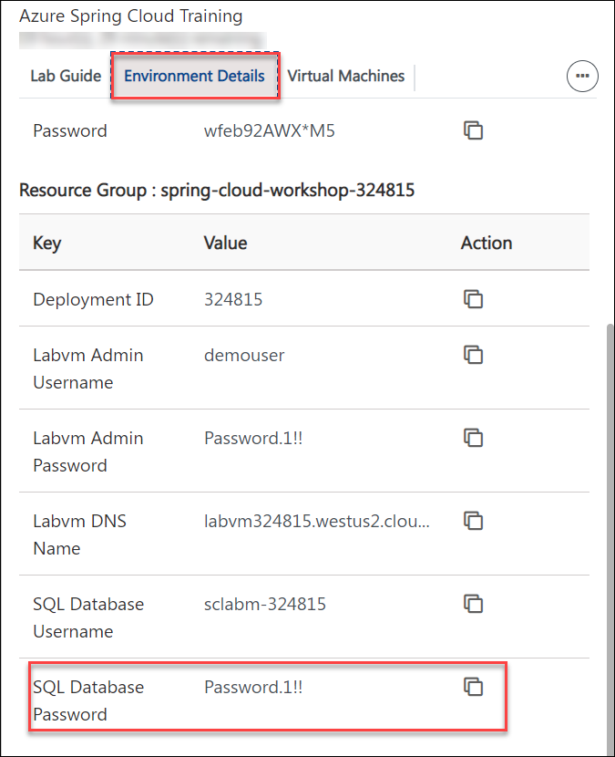
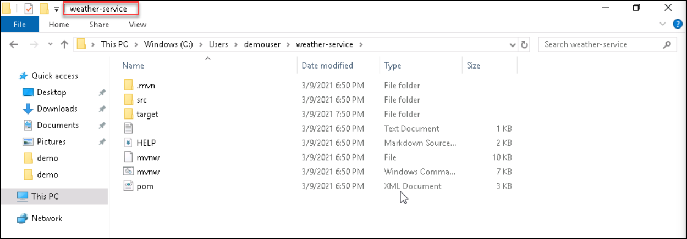

# Exercise 7 - Build a Spring Boot microservice using MySQL

In this section, we'll build another data-driven microservice. This time, we will use a relational database, a [MySQL database managed by Azure](https://docs.microsoft.com/en-us/azure/mysql/?WT.mc_id=azurespringcloud-github-judubois). And we'll use Java Persistence API (JPA) to access the data in a way that is more frequently used in the Java ecosystem.

---

## Task 1 : Create the application on Azure Spring Cloud

1. Create a specific `weather-service` application in your Azure Spring Cloud instance:

```bash
az spring-cloud app create -n weather-service
```

## Task 2 : Configure the MySQL Server instance

1. You should have a Azure Database for MySQL instance named `sclabm-DID` in the resource group `spring-cloud-workshop-DID`.


2. Before we can use it however, we will need to perform several tasks:

    - Create a MySQL firewall rule to allow connections from our local environment.
    - Create a MySQL firewall rule to allow connections from Azure Services. This will enable connections from Azure Spring Cloud.
    - Create a MySQL database.
 
3. Run the following commands in Git Bash. Make sure you are logged in to your Azure account. If not log in using `az login`.

```bash
# Obtain the info on the MYSQL server in our resource group:
MYSQL_INFO=$(az mysql server list --query '[0]')
MYSQL_SERVERNAME=$(az mysql server list --query '[0].name' -o tsv)
MYSQL_USERNAME="$(az mysql server list --query '[0].administratorLogin' -o tsv)@${MYSQL_SERVERNAME}"
MYSQL_HOST="$(az mysql server list --query '[0].fullyQualifiedDomainName' -o tsv)"

# Create a firewall rule to allow connections from your machine:
MY_IP=$(curl whatismyip.akamai.com 2>/dev/null)
az mysql server firewall-rule create \
    --server-name $MYSQL_SERVERNAME \
    --name "connect-from-lab" \
    --start-ip-address "$MY_IP" \
    --end-ip-address "$MY_IP"

# Create a firewall rule to allow connections from Azure services:
az mysql server firewall-rule create \
    --server-name $MYSQL_SERVERNAME \
    --name "connect-from-azure" \
    --start-ip-address "0.0.0.0" \
    --end-ip-address "0.0.0.0"

# Create a MySQL database
az mysql db create \
    --name "azure-spring-cloud-training" \
    --server-name $MYSQL_SERVERNAME

# Display MySQL username (to be used in the next section)
echo "Your MySQL username is: ${MYSQL_USERNAME}"

```
4. Note down your MySql username in notepad, we will need it in the next section. 

## Task 3 : Bind the MySQL database to the application

1. As we did for CosmosDB in the previous exercise, create a service binding for the MySQL database to make it available to Azure Spring Cloud microservices.

2. In the [Azure Portal](https://portal.azure.com/?WT.mc_id=azurespringcloud-github-judubois):

3. Navigate to your Azure Spring Cloud instance.

4. Click on Apps.

5. Click on `weather-service`.

6. Click on "Service Bindings" and then on "Create Service Binding".

7. Populate the service binding fields as shown.

  - The username will be displayed in last line of output from the section above.
  - The password can be retrieved from the environment details tab under `SQL Database Password`.

    

8. Click on `Create` to create the database binding


## Task 4 : Create a Spring Boot microservice

1. Now that we've provisioned the Azure Spring Cloud instance and configured the service binding, let's get the code for `weather-service` ready.

2. To create our microservice, we will invoke the Spring Initalizer service from the command line:

```bash
curl https://start.spring.io/starter.tgz -d dependencies=web,data-jpa,mysql,cloud-eureka,cloud-config-client -d baseDir=weather-service -d bootVersion=2.3.8 -d javaVersion=1.8 | tar -xzvf -
```
3. Navigate to the path `C:\Users\demouser\weather-service` to find the city service folder 



       > We use the `Spring Web`, `Spring Data JPA`, `MySQL Driver`, `Eureka Discovery Client` and the `Config Client` components.

## Task 5 : Add Spring code to get the data from the database

1. Navigate to the path `C:\Users\demouser\weather-service\src\main\java\com\example\demo`. Next to the `DemoApplication` class, create a `Weather.java` JPA entity:

```java
package com.example.demo;

import javax.persistence.Entity;
import javax.persistence.Id;

@Entity
public class Weather {

    @Id
    private String city;

    private String description;

    private String icon;

    public String getCity() {
        return city;
    }

    public void setCity(String city) {
        this.city = city;
    }

    public String getDescription() {
        return description;
    }

    public void setDescription(String description) {
        this.description = description;
    }

    public String getIcon() {
        return icon;
    }

    public void setIcon(String icon) {
        this.icon = icon;
    }
}
```

2. Then, in the same location create a Spring Data repository to manage this entity, called `WeatherRepository.java`:

```java
package com.example.demo;

import org.springframework.data.repository.CrudRepository;

public interface WeatherRepository extends CrudRepository<Weather, String> {
}
```

3. And finish coding this application by adding a Spring MVC controller called `WeatherController.java`:

```java
package com.example.demo;

import org.springframework.stereotype.Controller;
import org.springframework.web.bind.annotation.*;

@RestController
@RequestMapping(path="/weather")
public class WeatherController {

    private final WeatherRepository weatherRepository;

    public WeatherController(WeatherRepository weatherRepository) {
        this.weatherRepository = weatherRepository;
    }

    @GetMapping("/city")
    public @ResponseBody Weather getWeatherForCity(@RequestParam("name") String cityName) {
        return weatherRepository.findById(cityName).get();
    }
}
```

## Task 6 : Add sample data in MySQL

1. In order to have Hibernate automatically create your database, open up the `C:\Users\demouser\weather-service\src\main\resources\` and application.properties file and add:

```properties
spring.jpa.hibernate.ddl-auto=create
```

2. Then, in order to have Spring Boot add sample data at startup, in the same location create a `import.sql` file and add:

```sql
INSERT INTO `azure-spring-cloud-training`.`weather` (`city`, `description`, `icon`) VALUES ('Paris, France', 'Very cloudy!', 'weather-fog');
INSERT INTO `azure-spring-cloud-training`.`weather` (`city`, `description`, `icon`) VALUES ('London, UK', 'Quite cloudy', 'weather-pouring');
```

## Task 7 : Deploy the application

1. You can now build your "weather-service" project and send it to Azure Spring Cloud:

```bash
cd weather-service
./mvnw clean package -DskipTests
az spring-cloud app deploy -n weather-service --jar-path target/demo-0.0.1-SNAPSHOT.jar
cd ..
```

## Test the project in the cloud

1. Go to "Apps" in your Azure Spring Cloud instance.

2. Verify that `weather-service` has a `Registration status` which says `1/1`. This shows that it is correctly registered in the Spring Cloud Service Registry.

3. Select `weather-service` to have more information on the microservice.

4. Copy the "Test Endpoint" that is provided. You might have to click on `See more` to find it.

5. Now you can now use CURL to test the `/weather/city` endpoint. For example, to test for `Paris, France` city, append to the end of the test endpoint: `/weather/city?name=Paris%2C%20France`.
you should get:

```json
{"city":"Paris, France","description":"Very cloudy!","icon":"weather-fog"}
```
---

